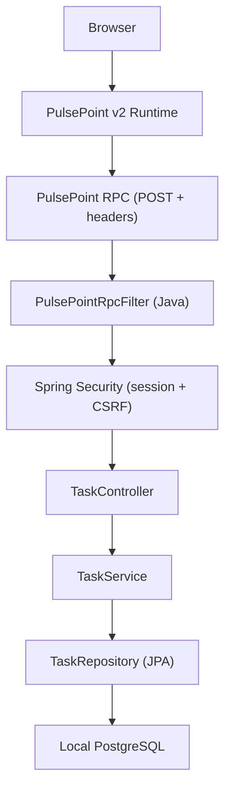

# Spring Boot + PulsePoint v2 — Integration Validation Plan

## Goal

Build a **small, focused CRUD application** using Spring Boot integrated with PulsePoint v2. The purpose is **not** a production-ready system — it's an integration test and reference project to:

1. Validate that PulsePoint's RPC mechanism works correctly with a Java/Spring Boot backend
2. Test CSRF, validation, and error handling through the PulsePoint wire protocol
3. Document the integration experience — what works, what doesn't, what's unclear
4. Produce a reusable reference for Java developers adopting PulsePoint

> [!IMPORTANT]
> **Explicitly out of scope:** Complex authentication (multi-role admin/user), complex business logic, SSE streaming, WebSockets, SPA navigation, production deployment concerns. These can be explored in follow-up phases after the core RPC integration is proven.

## Agreed Decisions
- **Auth:** Single in-memory user (`demo` / `demo123`), session-based, CSRF enabled. No roles.
- **Database:** Local PostgreSQL (user will provide connection details). Schema managed by `ddl-auto=update`.
- **No Flyway** — Flyway dependency removed from `pom.xml`.

## Target Architecture



Everything runs from **one Spring Boot server**. No separate frontend server, no Node.js, no React.

---

## User Review & Clarifications

- **Spring Boot version:** Existing `pom.xml` uses Spring Boot 4.1.1 on Java 21.
- **Entity choice:** `Task` entity (Title, Description, Status, Priority, Timestamps).
- **Authentication:** In-memory user (`demo` / `demo123`), session login, CSRF enabled.
- **Database:** Local PostgreSQL with fallback environment variables, `ddl-auto: update`.
- **Flyway:** Removed.

---

## Proposed Changes

### Phase 1: Spring Boot CRUD Foundation

Build the backend independently — verify it compiles, connects to PostgreSQL, and passes tests.

---

#### Database & Configuration

##### [MODIFY] application.yaml

`src/main/resources/application.yaml`

```yaml
spring:
  application:
    name: pulsepoint-demo
  datasource:
    url: ${SPRING_DATASOURCE_URL:jdbc:postgresql://localhost:5432/pulsepoint_db}
    username: ${SPRING_DATASOURCE_USERNAME:postgres}
    password: ${SPRING_DATASOURCE_PASSWORD:postgres}
    driver-class-name: org.postgresql.Driver
  jpa:
    hibernate:
      ddl-auto: update
    show-sql: true
    properties:
      hibernate:
        dialect: org.hibernate.dialect.PostgreSQLDialect

server:
  port: 8080
```

##### [MODIFY] pom.xml
- Remove `spring-boot-starter-flyway` and `spring-boot-starter-flyway-test`
- Ensure `postgresql` driver dependency is present.

---

#### Entity & Repository

##### [NEW] Task.java

`src/main/java/basic/sprinng/pulsepoint/entity/Task.java`

```java
@Entity
@Table(name = "tasks")
public class Task {
    @Id
    @GeneratedValue(strategy = GenerationType.IDENTITY)
    private Long id;

    @Column(nullable = false, length = 200)
    private String title;

    @Column(columnDefinition = "TEXT")
    private String description;

    @Column(nullable = false, length = 20)
    @Enumerated(EnumType.STRING)
    private TaskStatus status = TaskStatus.TODO;

    @Column(nullable = false, length = 20)
    @Enumerated(EnumType.STRING)
    private TaskPriority priority = TaskPriority.MEDIUM;

    @Column(name = "created_at", nullable = false, updatable = false)
    private LocalDateTime createdAt;

    @Column(name = "updated_at", nullable = false)
    private LocalDateTime updatedAt;

    @PrePersist
    protected void onCreate() {
        createdAt = updatedAt = LocalDateTime.now();
    }

    @PreUpdate
    protected void onUpdate() {
        updatedAt = LocalDateTime.now();
    }
}
```

##### [NEW] TaskStatus.java

`src/main/java/basic/sprinng/pulsepoint/entity/TaskStatus.java`

```java
public enum TaskStatus { TODO, IN_PROGRESS, DONE }
```

##### [NEW] TaskPriority.java

`src/main/java/basic/sprinng/pulsepoint/entity/TaskPriority.java`

```java
public enum TaskPriority { LOW, MEDIUM, HIGH }
```

##### [NEW] TaskRepository.java

`src/main/java/basic/sprinng/pulsepoint/repository/TaskRepository.java`

```java
public interface TaskRepository extends JpaRepository<Task, Long> { }
```

---

#### DTOs & Validation

##### [NEW] CreateTaskRequest.java

`src/main/java/basic/sprinng/pulsepoint/dto/CreateTaskRequest.java`

```java
public class CreateTaskRequest {
    @NotBlank(message = "Title is required")
    @Size(max = 200, message = "Title must be 200 characters or less")
    private String title;

    @Size(max = 2000, message = "Description must be 2000 characters or less")
    private String description;

    private String status;
    private String priority;
}
```

##### [NEW] UpdateTaskRequest.java

`src/main/java/basic/sprinng/pulsepoint/dto/UpdateTaskRequest.java`

##### [NEW] TaskResponse.java

`src/main/java/basic/sprinng/pulsepoint/dto/TaskResponse.java`

```java
public class TaskResponse {
    private Long id;
    private String title;
    private String description;
    private String status;
    private String priority;
    private LocalDateTime createdAt;
    private LocalDateTime updatedAt;
}
```

---

#### Service Layer

##### [NEW] TaskService.java (interface)

`src/main/java/basic/sprinng/pulsepoint/service/TaskService.java`

```java
public interface TaskService {
    List<TaskResponse> listTasks();
    TaskResponse getTask(Long id);
    TaskResponse createTask(CreateTaskRequest request);
    TaskResponse updateTask(Long id, UpdateTaskRequest request);
    void deleteTask(Long id);
}
```

##### [NEW] TaskServiceImpl.java

`src/main/java/basic/sprinng/pulsepoint/service/impl/TaskServiceImpl.java`

---

#### Exception Handling

##### [NEW] ResourceNotFoundException.java

`src/main/java/basic/sprinng/pulsepoint/exception/ResourceNotFoundException.java`

##### [NEW] GlobalExceptionHandler.java

`src/main/java/basic/sprinng/pulsepoint/exception/GlobalExceptionHandler.java`

Returns consistent JSON error responses matching the PulsePoint wire protocol format:

```json
{
  "error": "Validation failed",
  "errors": { "title": ["Title is required"] }
}
```

---

#### Security Configuration

##### [NEW] SecurityConfig.java

`src/main/java/basic/sprinng/pulsepoint/config/SecurityConfig.java`

```java
@Configuration
@EnableWebSecurity
public class SecurityConfig {

    @Bean
    public SecurityFilterChain filterChain(HttpSecurity http) throws Exception {
        http
            .authorizeHttpRequests(auth -> auth
                .requestMatchers("/login", "/css/**", "/js/**").permitAll()
                .anyRequest().authenticated()
            )
            .formLogin(form -> form
                .loginPage("/login")
                .defaultSuccessUrl("/tasks", true)
            )
            .logout(logout -> logout
                .logoutSuccessUrl("/login?logout")
            );
        return http.build();
    }

    @Bean
    public UserDetailsService userDetailsService(PasswordEncoder encoder) {
        var user = User.withUsername("demo")
            .password(encoder.encode("demo123"))
            .roles("USER")
            .build();
        return new InMemoryUserDetailsManager(user);
    }

    @Bean
    public PasswordEncoder passwordEncoder() {
        return new BCryptPasswordEncoder();
    }
}
```

---

#### Controllers & Thymeleaf Pages

##### [NEW] TaskController.java

Serves Thymeleaf views:
- `GET /login` → login page
- `GET /tasks` → task list page (server-rendered, later enhanced by PulsePoint)

##### [NEW] Thymeleaf templates

```
src/main/resources/templates/
├── login.html        # Simple login form
└── tasks.html        # Main task management page (will become PulsePoint-reactive)
```

---

### Phase 2: PulsePoint RPC Integration

---

#### PulsePoint Runtime

##### [NEW] pp-reactive-v2.min.js

`src/main/resources/static/js/pp-reactive-v2.min.js`

Download from CDN and serve locally.

---

#### PulsePoint CSRF Cookie Integration

##### [NEW] PulsePointCsrfFilter.java

`src/main/java/basic/sprinng/pulsepoint/pulsepoint/PulsePointCsrfFilter.java`

A filter that ensures the `pp_csrf` cookie (non-HttpOnly) is available for PulsePoint to read, and maps the `X-CSRF-Token` header.

---

#### PulsePoint RPC Handler & Registry

##### [NEW] PulsePointRpcFilter.java

`src/main/java/basic/sprinng/pulsepoint/pulsepoint/PulsePointRpcFilter.java`

Intercepts `X-PP-RPC: true` POST requests, extracts `X-PP-Function`, decodes JSON body, calls registered handler, and returns JSON.

##### [NEW] PulsePointRpcRegistry.java

`src/main/java/basic/sprinng/pulsepoint/pulsepoint/PulsePointRpcRegistry.java`

##### [NEW] PulsePointRpcFunction.java

`src/main/java/basic/sprinng/pulsepoint/pulsepoint/PulsePointRpcFunction.java`

##### [NEW] TaskRpcRegistrar.java

`src/main/java/basic/sprinng/pulsepoint/pulsepoint/handler/TaskRpcRegistrar.java`

Registers:
- `listTasks`
- `getTask`
- `createTask`
- `updateTask`
- `deleteTask`

---

#### Reactive Thymeleaf Templates

##### [MODIFY] tasks.html

Transform from server-rendered-only to PulsePoint-reactive:
- `<template pp-component="task_list">`
- `pp.state([])`, `pp.effect(...)`
- `pp.rpc("listTasks")`, `pp.rpc("createTask", data)`, `pp.rpc("deleteTask", {id})`
- `pp-for="task in tasks"` list rendering

---

## Package Structure (Final)

```text
src/main/java/basic/sprinng/pulsepoint/
├── Application.java
├── config/
│   └── SecurityConfig.java
├── controller/
│   └── TaskController.java
├── dto/
│   ├── CreateTaskRequest.java
│   ├── UpdateTaskRequest.java
│   └── TaskResponse.java
├── entity/
│   ├── Task.java
│   ├── TaskStatus.java
│   └── TaskPriority.java
├── exception/
│   ├── GlobalExceptionHandler.java
│   └── ResourceNotFoundException.java
├── repository/
│   └── TaskRepository.java
├── service/
│   ├── TaskService.java
│   └── impl/
│       └── TaskServiceImpl.java
└── pulsepoint/
    ├── PulsePointRpcFilter.java
    ├── PulsePointRpcRegistry.java
    ├── PulsePointRpcFunction.java
    ├── PulsePointCsrfFilter.java
    └── handler/
        └── TaskRpcRegistrar.java
```

---

## Verification Plan

### Automated Tests
1. `TaskServiceTest` — Unit tests for CRUD logic and validation.
2. `TaskControllerTest` — MVC controller & security tests.
3. `PulsePointRpcFilterTest` — Dispatching, CSRF validation, and error formats.

### Manual Verification
1. Run `./mvnw spring-boot:run`
2. Open `http://localhost:8080/login` -> login with `demo` / `demo123`
3. Load `/tasks` -> Verify reactive list loading via `listTasks` RPC
4. Add new task -> Verify instantaneous row append without page reload
5. Delete task -> Verify row removal without page reload
6. Test error validation -> Empty title returns structured error and renders in UI
